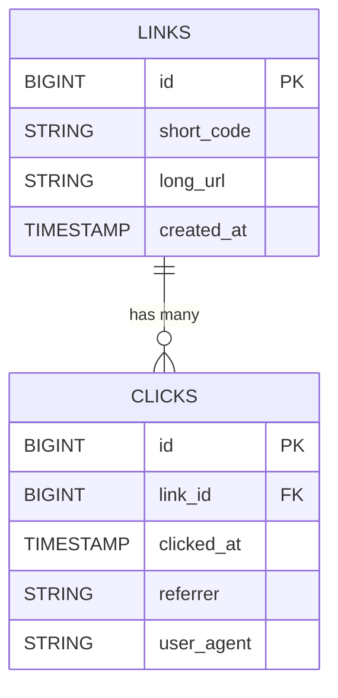

# BitURL - URL Shortener with Analytics

Shorten long URLs into compact links and track clicks on each one.

## Features
- Generate short links from any URL
- Redirect short codes to their original destination
- Per-link click analytics (total clicks + recent activity with referrer and user agent)

## Architecture
 

## Database Design

## Tech Stack
- **Backend:** FastAPI (Python), MySQL (Aiven), SQL via mysql-connector, Redis via Upstash, Queue Worker Hosted on Azure VM.
- **Frontend:** React (Vite), Tailwind CSS
- **Deployment:** Render (backend), Vercel (frontend)
